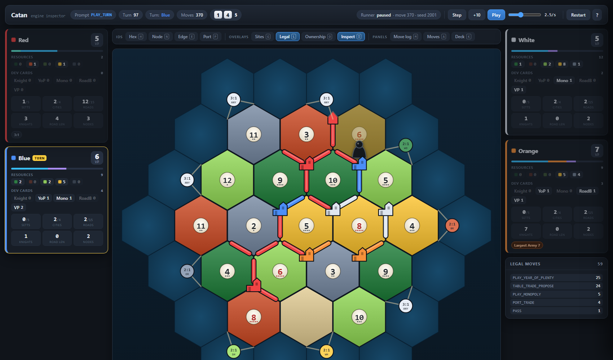

# Catan

A Catan engine built to run self-play fast, and a browser inspector to see what
it's doing.



## Speed

`python tools/benchmark.py`, single process, Python 3.14:

| Workload | Games/s | Steps/s |
|---|---:|---:|
| JSettlers-style bot | 67 | 27,000 |
| Uniform over every legal move | 30 | 279,000 |

Across 24 cores with random players (`run_game_batch.py`): **~395 games/s**,
averaging 354 turns a game.

The bot number is the one that matters for batch runs. Random play is faster per
step but drags games out to the 10,000-step cap, so fewer of them finish.

## Running it

```bash
python run_game.py          # watch a game in the browser
python run_game_batch.py    # batch self-play across every core
```

The inspector exposes the engine's own ids for every hex, intersection and road
slot, and lists the legal moves in whatever state you've paused in. Press `?` in
the page for the keys.

## Checking it

```bash
python tools/verify.py --players chaos   # is it still playing Catan?
python tools/regression.py               # did behaviour change?
python tools/benchmark.py                # did it get slower?
```

`verification/` re-derives every rule from the 2020 rulebook and checks the
engine's answer after every single action. `tools/regression.py` hashes 120 fixed
games, so a refactor can't change behaviour quietly.

## Layout

| | |
|---|---|
| `catan/` | the engine: state, actions, move generation, rules |
| `players/` | bots |
| `game/` | runner and parallel batch |
| `display/` | the browser inspector ([more](display/README.md)) |
| `verification/` | rulebook checker ([more](verification/README.md)) |
| `tools/` | benchmark, regression, targeted tests |
